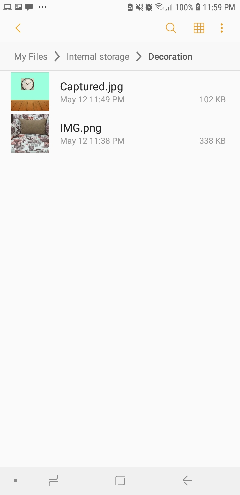

# Home-Design-App
Application for planning your rooms decoration 
The decoration play a major role in determining the mood of the place, from this point our project idea come in.

## Project Description:  
It is a cross Platform that can work on both Desktop and android devices to help imagine changes in the decoration of a room/place, saves the time and reach high quality as possible.   
Project main Features:    
### 1. Test Different Colors on the Walls    
-- Description :  
just choose the room you want to test the colors on its walls, then choose the color you want from the palette, finally click paint to watch the new wall color  
  
### 2. Test a new object scene in some place/room    
-- steps :  
1. choose the room you want to test  
2. choose the object you want to try it in the room  
or  
2. For Android only => click capture to take your own objects by the camera  
(if your caputering photo contains more than one object the app will detect the several objects and let you choose one of them)
3. Finally, Click on the place you want to replace the object in the room  
 

### 3. Save the room picture by the new edits on your device

## Project GUI Implementation:  
### -- Desktop Application :  
Developed By Kivy which is an open source Python library which is used to create applications on Windows, Linux, MacOS, Android and iOS.  

### -- Android Application :  
--- Configurations used to run Python/Kivy application to an Android :  
Step 1) Download Virtualbox https://www.virtualbox.org/wiki/Downloads
Step 2) Download an Ubuntu 18.04 image https://ubuntu.com/download/desktop
Step 3) Make sure your phone is in Developer mode by going to Settings -- About Phone -- Software -- tap on 'Build Number' 7 times quickly. Now go to Settings -- Developer Options and enable Stay Awake and USB Debugging.
Step 4) Connect your phone to your computer and make sure to Always Allow USB Debugging when your phone connects.
Step 5) Set up a new virtual machine in Virtualbox using the image from step 2. I allocated 2048 MB of memory and 20 GB of disk space.
Step 6) Install Ubuntu on the virtual machine
Step 7) Open the Terminal in your virtual machine and run the following commands:
- Sudo apt install git
- git clone https://github.com/kivy/buildozer.git
- cd buildozer
- sudo apt-get install python3.6
- sudo apt-get install -y python3-setuptools
- sudo python3 setup.py install
- cd ..
- git clone https://github.com/Dirk-Sandberg/KivyHelloWorld
- cd KivyHelloWorld - buildozer init - sudo apt update - sudo apt install -y git zip unzip openjdk-8-jdk python3-pip autoconf libtool pkg-config zlib1g-dev libncurses5-dev libncursesw5-dev libtinfo5 cmake libffi-dev - pip3 install --user --upgrade cython virtualenv - Sudo apt-get install cython - buildozer android debug deploy run  

--- Screen Shots :

